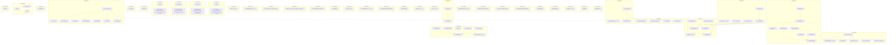

# Knowledge Base

Total entries: 1

## Architecture Overview (39 communities)

```mermaid
graph TB
  subgraph comm_12["Community 12"]
    opencode_opencode["opencode.json"]
  end
  subgraph comm_17["Community 17"]
    opencode_plugins_graphify["graphify.js"]
  end
  subgraph comm_30["Community 30"]
    backend_apps_dataset_init["dataset/__init__.py"]
  end
  subgraph comm_29["Community 29"]
    backend_apps_dataset_admin["dataset/admin.py"]
  end
  subgraph comm_13["Community 13"]
    backend_apps_dataset_apps["dataset/apps.py"]
  end
  subgraph comm_18["Community 18"]
    backend_apps_dataset_migrations_0001_initial["dataset/migrations/0001_initial.py"]
  end
  subgraph comm_19["Community 19"]
    backend_apps_dataset_migrations_0002_alter_dataset_status["0002_alter_dataset_status.py"]
  end
  subgraph comm_20["Community 20"]
    backend_apps_dataset_migrations_0003_alter_dataset_status["0003_alter_dataset_status.py"]
  end
  subgraph comm_31["Community 31"]
    backend_apps_dataset_migrations_init["dataset/migrations/__init__.py"]
  end
  subgraph comm_2["Community 2"]
    backend_apps_dataset_models["dataset/models.py"]
    backend_apps_dataset_permissions["permissions.py"]
    backend_apps_dataset_serializers_datasetdetail["datasetDetail.py"]
    backend_apps_dataset_serializers_datasetlist["datasetList.py"]
    backend_apps_dataset_serializers_datasettable["datasetTable.py"]
    backend_apps_dataset_serializers_datasetupload["datasetUpload.py"]
    backend_apps_dataset_urls["dataset/urls.py"]
    backend_apps_dataset_views["dataset/views.py"]
  end
  subgraph comm_0["Community 0"]
    backend_apps_dataset_repositories["dataset/repositories.py"]
    backend_apps_dataset_tests_test_dataset_service["test_dataset_service.py"]
    backend_apps_dataset_tests_test_views["test_views.py"]
    backend_services_ai_sql_executor["sql_executor.py"]
  end
  subgraph comm_9["Community 9"]
    backend_apps_queries_services_init["queries/services/__init__.py"]
    backend_apps_queries_services_cache_service["cache_service.py"]
    backend_apps_queries_services_query_service["query_service.py"]
  end
  subgraph comm_3["Community 3"]
    backend_apps_dataset_services_init["dataset/services/__init__.py"]
    backend_apps_dataset_services_dataset_service["dataset_service.py"]
    backend_apps_dataset_services_file_service["file_service.py"]
    backend_apps_dataset_services_schema_service["schema_service.py"]
    backend_apps_dataset_tests_test_file_service["test_file_service.py"]
    backend_apps_dataset_tests_test_schema_service["test_schema_service.py"]
  end
  subgraph comm_32["Community 32"]
    backend_apps_dataset_tests_init["tests/__init__.py"]
  end
  subgraph comm_33["Community 33"]
    backend_apps_queries_init["queries/__init__.py"]
  end
  subgraph comm_4["Community 4"]
    backend_apps_queries_admin["queries/admin.py"]
    backend_apps_queries_models_init["models/__init__.py"]
    backend_apps_queries_models_queryfeedback["queryFeedback.py"]
    backend_apps_queries_models_queryhistory["queryHistory.py"]
    backend_apps_queries_models_queryresult["queryResult.py"]
    backend_apps_queries_repositories["queries/repositories.py"]
  end
  subgraph comm_14["Community 14"]
    backend_apps_queries_apps["queries/apps.py"]
  end
  subgraph comm_21["Community 21"]
    backend_apps_queries_migrations_0001_initial["queries/migrations/0001_initial.py"]
  end
  subgraph comm_34["Community 34"]
    backend_apps_queries_migrations_init["queries/migrations/__init__.py"]
  end
  subgraph comm_6["Community 6"]
    backend_apps_queries_serializers_init["serializers/__init__.py"]
    backend_apps_queries_serializers_query_request["query_request.py"]
    backend_apps_queries_serializers_query_response["query_response.py"]
    backend_apps_queries_urls["queries/urls.py"]
    backend_apps_queries_views["queries/views.py"]
  end
  subgraph comm_35["Community 35"]
    backend_apps_users_init["users/__init__.py"]
  end
  subgraph comm_1["Community 1"]
    backend_apps_users_admin["users/admin.py"]
    backend_apps_users_models["users/models.py"]
    backend_apps_users_serializers_auth["serializers/auth.py"]
    backend_apps_users_serializers_profile["profile.py"]
    backend_apps_users_services_init["users/services/__init__.py"]
    backend_apps_users_services_auth_service["auth_service.py"]
    backend_apps_users_services_user_service["user_service.py"]
  end
  subgraph comm_15["Community 15"]
    backend_apps_users_apps["users/apps.py"]
  end
  subgraph comm_22["Community 22"]
    backend_apps_users_migrations_0001_initial["users/migrations/0001_initial.py"]
  end
  subgraph comm_23["Community 23"]
    backend_apps_users_migrations_0002_profile_query_count_profile_query_limit["0002_profile_query_count_profile_query_limit.py"]
  end
  subgraph comm_24["Community 24"]
    backend_apps_users_migrations_0003_remove_user_user_type_id["0003_remove_user_user_type_id.py"]
  end
  subgraph comm_36["Community 36"]
    backend_apps_users_migrations_init["users/migrations/__init__.py"]
  end
  subgraph comm_8["Community 8"]
    backend_apps_users_urls["users/urls.py"]
    backend_apps_users_views_auth["views/auth.py"]
  end
  subgraph comm_37["Community 37"]
    backend_config_init["config/__init__.py"]
  end
  subgraph comm_25["Community 25"]
    backend_config_asgi["asgi.py"]
    backend_config_asgi_rationale_1["ASGI config for conversationalBI project.  It exposes the ASGI callable as a mod"]
  end
  subgraph comm_26["Community 26"]
    backend_config_settings["settings.py"]
    backend_config_settings_rationale_1["Django settings for conversationalBI project.  Generated by 'django-admin startp"]
  end
  subgraph comm_27["Community 27"]
    backend_config_urls["config/urls.py"]
    backend_config_urls_rationale_1["URL configuration for conversationalBI project.  The `urlpatterns` list routes U"]
  end
  subgraph comm_28["Community 28"]
    backend_config_wsgi["wsgi.py"]
    backend_config_wsgi_rationale_1["WSGI config for conversationalBI project.  It exposes the WSGI callable as a mod"]
  end
  subgraph comm_11["Community 11"]
    backend_conftest["conftest.py"]
  end
  subgraph comm_16["Community 16"]
    backend_manage["manage.py"]
  end
  subgraph comm_5["Community 5"]
    backend_services_ai_init["ai/__init__.py"]
    backend_services_ai_ai_query_service["ai_query_service.py"]
    backend_services_ai_chart_selector["chart_selector.py"]
    backend_services_ai_chart_selector_chartselector["ChartSelector"]
    backend_services_ai_prompt_builder["prompt_builder.py"]
    backend_services_ai_prompt_builder_promptbuilder["PromptBuilder"]
    backend_services_ai_sql_agent["sql_agent.py"]
    backend_services_ai_sql_validator["sql_validator.py"]
  end
  subgraph comm_7["Community 7"]
    frontend_package["package.json"]
  end
  subgraph comm_10["Community 10"]
    frontend_src_animations["animations.js"]
    frontend_src_api["api.js"]
    frontend_src_main["main.js"]
  end
  subgraph comm_38["Community 38"]
    vault_obsidian_app["app.json"]
  end
  backend_apps_dataset_serializers_datasetdetail -.-> backend_apps_dataset_models
  backend_apps_dataset_serializers_datasetlist -.-> backend_apps_dataset_models
  backend_apps_dataset_serializers_datasettable -.-> backend_apps_dataset_models
  backend_apps_dataset_services_dataset_service -.-> backend_apps_dataset_models
  backend_apps_dataset_views -.-> backend_apps_dataset_models
  backend_apps_dataset_views -.-> backend_apps_dataset_permissions
  backend_apps_dataset_serializers_datasetdetail -.-> backend_apps_dataset_serializers_datasettable
  backend_apps_dataset_views -.-> backend_apps_dataset_serializers_datasetdetail
  backend_apps_dataset_views -.-> backend_apps_dataset_serializers_datasetlist
  backend_apps_dataset_views -.-> backend_apps_dataset_serializers_datasetupload
  backend_apps_dataset_services_dataset_service -.-> backend_apps_dataset_services_file_service
  backend_apps_dataset_services_dataset_service -.-> backend_apps_dataset_services_schema_service
  backend_apps_dataset_urls -.-> backend_apps_dataset_views
  backend_apps_queries_admin -.-> backend_apps_queries_models_queryfeedback
  backend_apps_queries_admin -.-> backend_apps_queries_models_queryhistory
  backend_apps_queries_admin -.-> backend_apps_queries_models_queryresult
  backend_apps_queries_models_queryfeedback -.-> backend_apps_queries_models_queryhistory
  backend_apps_queries_serializers_query_response -.-> backend_apps_queries_models_queryfeedback
  backend_apps_queries_views -.-> backend_apps_queries_models_queryfeedback
  backend_apps_queries_models_queryresult -.-> backend_apps_queries_models_queryhistory
  backend_apps_queries_repositories -.-> backend_apps_queries_models_queryhistory
  backend_apps_queries_serializers_query_response -.-> backend_apps_queries_models_queryhistory
  backend_apps_queries_views -.-> backend_apps_queries_models_queryhistory
  backend_apps_queries_repositories -.-> backend_apps_queries_models_queryresult
  backend_apps_queries_serializers_query_response -.-> backend_apps_queries_models_queryresult
  backend_apps_queries_services_query_service -.-> backend_apps_queries_repositories
  backend_apps_queries_services_query_service -.-> backend_apps_queries_services_cache_service
  backend_apps_queries_urls -.-> backend_apps_queries_views
  backend_apps_users_admin -.-> backend_apps_users_models
  backend_apps_users_serializers_auth -.-> backend_apps_users_models
  backend_apps_users_serializers_profile -.-> backend_apps_users_models
  backend_apps_users_services_auth_service -.-> backend_apps_users_models
  backend_apps_users_services_user_service -.-> backend_apps_users_models
  backend_apps_users_views_auth -.-> backend_apps_users_serializers_auth
  backend_apps_users_urls -.-> backend_apps_users_views_auth
  backend_services_ai_ai_query_service -.-> backend_services_ai_chart_selector
  backend_services_ai_ai_query_service -.-> backend_services_ai_prompt_builder
  backend_services_ai_ai_query_service -.-> backend_services_ai_sql_agent
  backend_services_ai_ai_query_service -.-> backend_services_ai_sql_executor
  backend_services_ai_ai_query_service -.-> backend_services_ai_sql_validator
  frontend_src_main -.-> frontend_src_animations
  frontend_src_main -.-> frontend_src_api
```

## Model

- [[dataset/models.py]]
