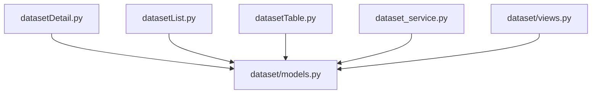

# dataset/models.py

## Used By

- [[datasetDetail.py]]
- [[datasetList.py]]
- [[datasetTable.py]]
- [[dataset_service.py]]
- [[dataset/views.py]]

## Source

`backend/apps/dataset/models.py`

---
*Community: 2*